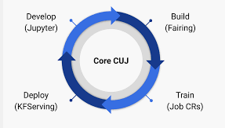

# cnn-text-classifier-dev
This repository contains examples of data science CUJs resolved using [kubeflow](https://www.kubeflow.org).

---
In particular, as of now, this repo features:
- **Notebooks:**
    - Exploratory data analysis
    - Local training with keras
    - Launching a katib hyperparameter tuning job using fairing + katib
- **Pipelines:**
    - Code refactor and generation of lightweight pipeline
    - Code refactor into components
        - Using CRD operators (TFJob) - Launcher
        - Using hardware accelerators
    - Metadata component to recalibrate models based on data drift/skew using TFDV + MLMD
---    
This repo uses kubeflow v1.0 deployed on Google Kubernetes Engine  
The idea is to reproduce a canonical workflow in Machine Learning:

| **Step**        | Kubeflow comp           | This repo  |
| ------------- |:-------------:| -----:|
| Exploratory data analysys      | Jupyter notebooks | `notebook` folder. Sections 01-02 |
| Hyperparameter tuning      | Jupyter notebooks + katib + fairing      |   `notebook` folder Section 03 |
| Simple test pipeline | pipelines      |    `pipelines` folder. Pipeline def 01 |
| Production pipeline | pipelines, metadata, TFJob Operator, KFServing      |    `pipelines` folder. Pipeline def 02 |
| Others: functional observability (data-drift) | pipelines, metadata, TFDV*      |    `observability` folder. Component 01 |             