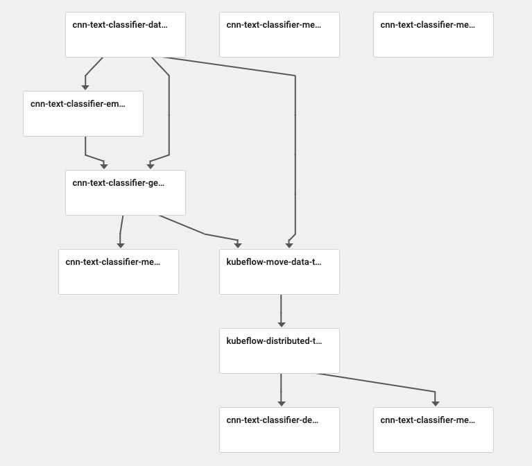

# build-train-deploy pipeline

The code is structured as follows:

```
root
└── pipeline_definition_lightweight.py
└── pipeline_definition_lightweight.py
└── image_code
    └── XX_component_name
        ├── XX_component_name.yaml
        ├── build_image.sh
        ├── Dockerfile
        └── src
            ├── component_code.py
            └── requirements.txt
            
```

The lightweight pipeline definition instantiates a pipeline using the `func_to_container_op`


```python
func_to_container_op(train_model,packages_to_install=['gensim==3.2.0', 'keras==2.3.1',
                                                      'pandas==1.0.1',
                                                      'tensorflow==2.1.0',
                                                      'numpy==1.18.1', 'gcsfs==0.6.0',
                                                      'google-cloud-storage==1.26.0'])
```

The component pipeline definition instantiates a pipeline using resuable components `func_to_container_op`
```python
train_model_component_file = 'image_code/05_train_model/component.yaml'
train_model_component = components.load_component_from_file(train_model_component_file)
```

The pipeline does the following: (component version)
- It logs dataset metadata for the train and validation datasets
- Performs initial data preparation
- Generates the dense embeddings matrix
- Generates model metadata
- If using distributed training (TFJOB):
    - Data is moved to a PVC
    - Generate a TFJOB spec definition and launch an number of paralell additional training containers
- If not using TFJob:    
    - Launch a training container (with or without a GPU attached*)
- Training medatada is logged in MLMD (e.g. training time)
- Deploy a prediction endpoint service using KFServing





```Usage
usage: 02_pipeline_definition_components.py [-h]
                                            [--train_data_path TRAIN_DATA_PATH]
                                            [--test_data_path TEST_DATA_PATH]
                                            [--column_target_value COLUMN_TARGET_VALUE]
                                            [--column_text_value COLUMN_TEXT_VALUE]
                                            [--val_data_pct VAL_DATA_PCT]
                                            [--num_words NUM_WORDS]
                                            [--gcp_bucket GCP_BUCKET]
                                            [--json_tokenizer_path JSON_TOKENIZER_PATH]
                                            [--w2v_model_path W2V_MODEL_PATH]
                                            [--embbeding_dim EMBBEDING_DIM]
                                            [--dropout DROPOUT]
                                            [--filter_sizes FILTER_SIZES]
                                            [--num_filters NUM_FILTERS]
                                            [--num_conv_layers NUM_CONV_LAYERS]
                                            [--maxpool_strides MAXPOOL_STRIDES]
                                            [--epochs EPOCHS]
                                            [--batch_size BATCH_SIZE]
                                            [--host HOST]
                                            [--client_id CLIENT_ID]
                                            [--other_client_id OTHER_CLIENT_ID]
                                            [--other_client_secret OTHER_CLIENT_SECRET]
                                            [--namespace NAMESPACE]
                                            [--workdir WORKDIR]
                                            [--dist_training DIST_TRAINING]
                                            [--gpu_support GPU_SUPPORT]

```

- *Images are generated using the GPU version of tensorflow so we don not have to worry to deploy CUDA